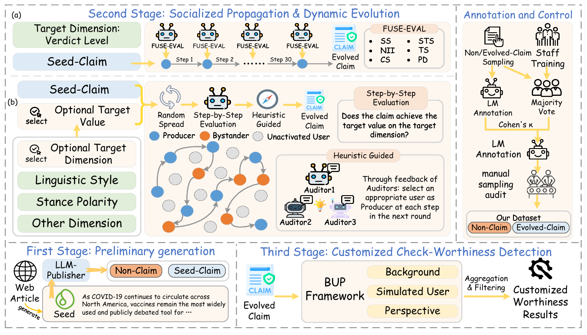

# Beyond-Static-Artifacts: An Evolutionary Framework for Synthetic Claim Generation
🏆 Our paper has been accepted as a main conference paper at ACL 2026!
## Abstract
With the generative capabilities of large language models (LLMs) reshaping the information ecosystem, the concern with the sociological validity of claim detection benchmarks is increasing. Current claim detection benchmarks predominantly treat claims as static textual artifacts, overlooking the sociological etiology of how information naturally emerges and mutates. In this paper, we propose an evolutionary paradigm that models claims as socially evolving entities. Specifically, we introduce a socially generative framework for synthetic claim generation, a multi-agent simulation grounded in the Open Claims Model. By decomposing claims into context, utterance, and proposition, our approach enables the precise simulation of unmitigated propagation to capture truth decay, and intervened propagation with multi-auditor oversight for targeted generation. Furthermore, we propose the background-user-perspective (BUP) framework, which reformulates check-worthiness as a condition-dependent probability rooted in the social environment. Experiments on our datasets verify the data quality and reveal how network topology and user attributes systematically shape veracity drift.
## Architecture

A social simulation framework for claim evolution and customized check-worthiness detection.
## Premilinary
### Open Claims Model (OCM)
OCM represents a claim through three layers—context, utterance, and proposition—to disentangle narrative background, linguistic form, and factual content. It further parameterizes these layers with interpretable dimensions (e.g., stance, causality, veracity) to trace and control how claims evolve across social networks. Details can be found in the `assets` folder.
### Simulated Social Environment
This environment simulates claim evolution in a social environment with heterogeneous agents modeled from real users’ psychometric traits and sociocultural groups. Claims propagate over different network topologies (random, clustered, scale-free) to study how social structure drives information mutation and veracity drift. The details of the three types of networks and user information can be found in the `assets` folder.
## Methodology
### Context-Anchored Initialization
- **Data Preparation:** Seed contexts are extracted from authoritative news abstracts on high-stakes topics by filtering out non-logical content and keeping only atomic semantic units. Details can be found in `abstract.json`.
- **Seed/non-claim Generation:** Using these contexts, GPT-4o generates claims and non-claims under strict public-evidence criteria, retaining only verifiable statements as claims. **Use the following command for initial generation:**
```bash
python seed_non.py --input abstract.json --seed_out seed.jsonl --non_out non.jsonl --num_seed 5 --num_non 2 --model_seed gpt-4o --model_non gpt-4o
```
### Socialized Propagation and Evolution
- **Unmitigated Propagation:** Unmitigated propagation simulates truth decay by sequentially rewriting claims as they spread through a social network, allowing semantic drift to emerge naturally. Different network topologies (random, scale-free, clustered) model how user attributes, hubs, and community homogeneity shape veracity evolution. **Use the following command to run seed-claim evolution under unmitigated propagation:**
```bash
# random network
python random_propagation_verdict.py

# scale-free network
python hub_propagation_verdict.py

# clustered network (three types of user groups)
python cluster_propagation_verdict.py
```
- **Intervened Propagation:** Intervened propagation steers claim evolution toward target attributes by letting matched users actively rewrite claims while others pass them through. Multi-auditor oversight monitors multi-step diffusion and corrects deviations to keep evolution on the desired trajectory. **Use the following command to run seed-claim evolution under intervened propagation:**
```bash
python network_propagation.py 
```
### Customized Check-Worthiness Evaluation
We introduce the Background–User–Perspective (BUP) framework, which models claim check-worthiness as a dynamic function of social context, user attributes, and evaluation criteria rather than a static property. You can find a simple diagram of the BUP Framework and the related propagation network in the `assets` folder. **Use the following command for customized check-worthiness detection:**
```bash
# step 1:
# by default, the LLM automatically extracts the Time Node (T), Regulatory Pressure (P), and Trust Climate (C) for each evolved-claim
# alternatively, you can manually specify T, P, and C for each evolved-claim
python background.py

# step 2: propagation is conducted within a network constructed based on Dunbar's layer theory
python propagation.py

# step 3: manually select the appropriate user type and evaluation perspective to obtain the desired "check-worthiness" result you desire
python evaluate.py
```
## Dataset
We followed the **Context-Anchored Initialization** and **Socialized Propagation and Evolution** procedures outlined in the Methodology, and provided the corresponding demo dataset in the `data` folder. It includes `non-claims`, `seed-claims`, as well as the `evolved-claims` resulting from the dissemination and evolution of the seed-claims.

## Citation
If you find this work helpful, please consider citing our paper:
```bash
@inproceedings{Teng2026BeyondStatic,
    author    = {Yeqing Teng and Shuxia Lin and Linhai Zhang and Jiasheng Si and Weiyu Zhang and Wenpeng Lu and Deyu Zhou and Xiaoming Wu},
    title     = {Beyond Static Artifacts: An Evolutionary Framework for Synthetic Claim Generation},
    booktitle = {Proceedings of the 64th Annual Meeting of the Association for Computational Linguistics},
    year      = {2026}
}
```

